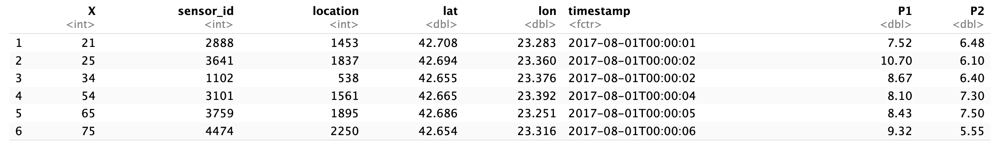
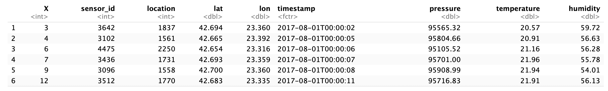
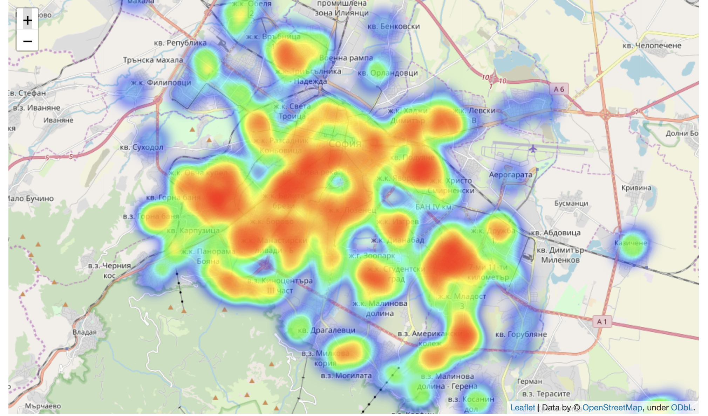
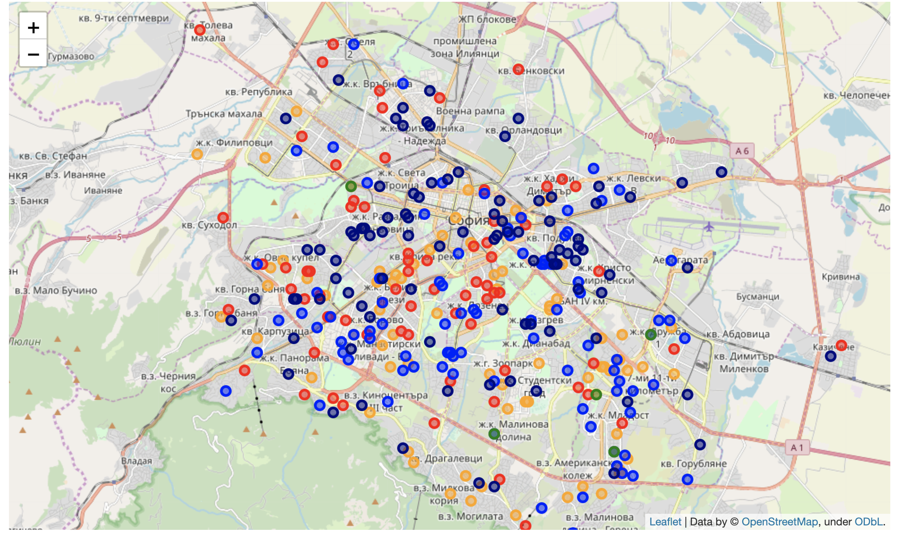

#Introduction

Air pollution is one of the most serious problems in the world. Our ultimate goal is to test the difference of API of each sensor within different years to address the changes in different places of Sofia. 

There are nearly 500 sensors in Sofia. They record P2, the air pollution index, almost every second. 

What we are interested in is whether the environment in different sensor locations gets worse or better in two years. So we will do a two sample T-test between the averaged PM2.5 of 2017.08-2018.07 and 2018.08-2019.07. With the p-values, we could conclude that most of sensors have significant changes except 5 sensors. And PM2.5 tends to increase in the central area, but it tends to decrease in the marginal area. 

# Analysis

## Data Introduction and Cleaning

Our data is from kaggle https://www.kaggle.com/hmavrodiev/sofia-air-quality-dataset.
It contains 13GB data, which is stored separately in 50 csv files. Each csv file contains information like sensor_id, observation time, longitude, and latitude within a month. Half of these csv files contains p2 which is the target response. 

```{r echo=FALSE, fig.cap="Part of the results of T-test", fig.pos = 'h',out.width = '80%'}

```

```{r echo=FALSE, fig.cap="Part of the results of T-test", fig.pos = 'h',out.width = '80%'}

```


## Data processing

For each csv which contains information about air pollution within a month, we first cut each sensor out to make a **sensorid_year_month.csv**. Since the computation was quite large for this step, we used CHTC to parallel the computation. Then we wrote a shell file to merge those files by years for each sensor. At last, we got two files for each sensor, which contains information of air quality in 2017.8-2018.7, 2018.8-2019.7. There are some sensors which missed the data for a whole year, we deleted those sensors. After processing, there are 351 sensors.

## Hypothesis Testing 

Part of result of the two sample T-test for the 351 sensors has been stated below. 

```{r echo=FALSE, fig.cap="Part of the results of T-test", fig.pos = 'h',out.width = '80%'}
knitr::include_graphics("t-test.png")
```

As the table shows, all the sensors in this table have p-values extremely smaller than 0.05. So they all have significant changes in the two years. Actually, most of the sensors have significant changes except only 5 sensors. 

##Further Exploration 

With the current data set, we would like to explore whether the humidity, pressure and temperature has a significant influence on the changes of PM2.5 by fitting a linear regression. However, unfortunately in our current data set, the sensors with three variables are all different from the sensors with PM2.5. So we could not further explore the relationship between these three variables and PM2.5. 


##Visualization

```{r echo=FALSE, fig.cap="", fig.pos = 'h',out.width = '80%'}

```

From the heatmap you can find the sensor distribution in Sofia. Most of the sensors are distributed in the central area. 

```{r echo=FALSE, fig.cap="", fig.pos = 'h',out.width = '80%'}

```

From the results of our tests, there are only 5 sensors with no difference between last 2 years, which are in green color. The blue dots show that PM2.5 decrease less by these sensors. The navy dots show that PM2.5 decrease more. However, the orange dots and red dots show that PM2.5 increase less and more, respectively. Roughly speaking, PM2.5 tends to increase in the central area, but it tends to decrease in the marginal area.

```{r echo=FALSE, fig.cap="", fig.pos = 'h',out.width = '80%'}
knitr::include_graphics("north&central.png")
```

There are some informative places. In the northwest, we find that PM2.5 near the River decrease more. Maybe the environment around this river help decrease PM2.5. In the middle area, we find two places have a large increase of PM2.5, that is, Russian Monument Square and National Palace of Culture. Maybe these two places take charge of the increase. 

##Weaknesses

Due to the different length of original recording in sensors, we only get 351 sensors which have records of PM2.5 from the 2017.08 to 2019.07. So the number of observations are limited. 

Also due to the limited information from the data set, it's hard for us to futher explore the possible reason for the changes of PM2.5. 


#Conclusion 

What we interest in is whether the PM2.5 change between last two years in Sofia. From the results of our t-test, most of the sensors have a significant change except only 5 sensors with no difference. From the map, we find that the location of the city more or less has an effect on PM2.5.

In the future, we could collect more information about the sensors such as the distance of these sensors from the factory and so on, whether there exits a river nearby an so on. So we could detect the possible reasons for the changes of PM2.5 
